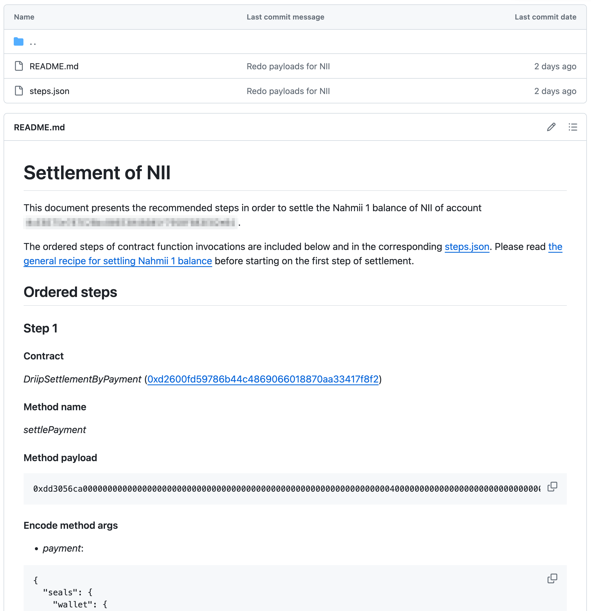

# Nahmii 1 Settlement Payloads

**Disclaimer: Interacting directly with smart contracts should only be attempted by experienced users. Mistakes can be
expensive and irreversible. If you are not confident using Ethereum, please seek help from someone who is. This guide is
provided for illustrative purposes only. Nahmii AS accepts no liability for funds lost as a result of your actions
following this document. Use at your own risk.**

Before we dive into the details, we'd like to highlight some important points:

* All funds on Nahmii 1.0 are safe and can be exited using the published payload data **at any point in the future**.
* Manual exits in general require three steps, each consisting of a transaction on Ethereum.
* The set of three transactions will use around 2.5 million gas in total, which can be expensive if gas prices are high.
* The value that may be exited may be less than the cost of exiting. Before starting the exit procedure for a wallet
  and currency we advice that you check the value that may be withdrawn in the final step, this to ascertain whether the
  exit procedure is worth the cost.
* This guide refers to MetaMask (a popular wallet management browser extension) as the preferred method for making
  transactions. Other tools like myetherwallet.com are possible to use, but are not covered here.
* Nahmii AS will not be providing further support for users who wish to exit their funds from Nahmii 1.0 at this stage
  beyond the information in this guide.
* Please read the disclaimer at the top of this page!

# Three Steps

The exit of a wallet's Nahmii 1.0 holdings of a given currency normally require three steps, each involving an on-chain
transaction. Some wallets, however, have funds that are part-way through this process. In these cases fewer than three
or up to four transactions are required. The description in this document is primarily focused on the canonical scenario
of three transactions.

If your generated files indicate that four steps are needed, this typically corresponds to an initial step where a
settlement challenge is stopped before a new one is started. If you are facing less than three steps, you've
already done the initial start of settlement challenge, and possibly also settled.

We'll start with the canonical scenario, where a wallet has no ongoing settlement challenges. The first step in the
exit process is to **start a settlement challenge**. This starts a five-day timer, during which anyone can
challenge your settlement request if they believe it to be fraudulent.

Assuming that your settlement request reaches the five-day cutoff without being challenged, the second step is to
**settle** (i.e finalise your settlement). At this point, funds are ready to be withdrawn from Nahmii 1.0's treasury.

The third and final step is to **withdraw**, at which point tokens will be sent to your wallet.

Typical gas usage and the recommended gas limit for each transaction is set out below:

1. Start settlement challenge – 650,000 typical gas usage, 1,000,000 recommended gas limit
2. Settle – 1,500,000 typical gas usage, 1,750,000 recommended gas limit
3. Withdraw – 415,000 typical gas usage, 500,000 recommended gas limit

**Note: These amounts can vary, but typical values are based on a reasonably large sample size.** We cannot provide
guidance relating to gas prices for these transactions; it is your responsibility to ensure that a sufficiently high gas
price is used for each transaction. Also note that MetaMask provides an estimate of the gas required for each
transaction,
which value is usually reasonable.

# Hex Data & MetaMask

We have published the transaction hex data "payloads" for every eligible wallet on Nahmii 1.0 as if they have requested
exit of their entire holdings. These payloads are sufficient to exit each wallet's entire holding in the concerned
currencies, regardless of whether they have started a full or partial exit workflow previously.

Begin by navigating to the folder of the currency in this repo, e.g. the [_NII_](NII) folder. Inside this folder you
will find a folder for every wallet on Nahmii 1.0 with a non-zero (on-chain + off-chain) balance. Find your wallet
address.

For the next step, we will need to use MetaMask to add hex data to a transaction on Ethereum. This option is not enabled
in MetaMask by default. You will need to open and unlock MetaMask, then navigate to your wallet by clicking on the
vertical ellipsis in the top right corner:

Next, select the options _Settings_, then _Advanced_ and enable _Show hex data_:

You are now ready to proceed to the exit process.

# Execution of Exit Steps

After finding the folder with the same name as your wallet address, you will see something like this:

The list of exit steps shown here depends on whether your wallet has an in-progress settlement or not. Regardless, you
should follow the steps in order as described.

Each step in the process will require you to send a 0 ETH transaction to the contract address listed under the step's
"Contract" heading. Using the example from above, begin by opening and unlocking MetaMask (which should be connected to
the wallet you wish to use).

Click _Send_ to open the transaction page:

Next, add the contract _address_ from the exit step. **Note: this address will not be the same for all steps.**

Moving further, copy the value of "Method payload" into the "Hex data" field MetaMask field. Remember to leave the
transaction "Amount" field with the value of 0 ETH.

Hitting the _Next_ button you should update or at least verify MetaMask's estimated limit for the transaction. Thus
hit the edit "crayon" next to the estimated fee.

Then open the _Advanced_ section.

At this point you may see MetaMask's estimates of gas limit for the transaction.

Recall the suggested gas limits from earlier:

1. Start settlement challenge – 650,000 typical gas usage, 1,000,000 recommended gas limit
2. Settle – 1,500,000 typical gas usage, 1,750,000 recommended gas limit
3. Withdraw – 415,000 typical gas usage, 500,000 recommended gas limit

When the final step has been executed, funds will have been transferred from the Nahmii 1.0 client fund contract (where
all user's deposits are kept) back to your wallet on Ethereum. The process is then complete.

