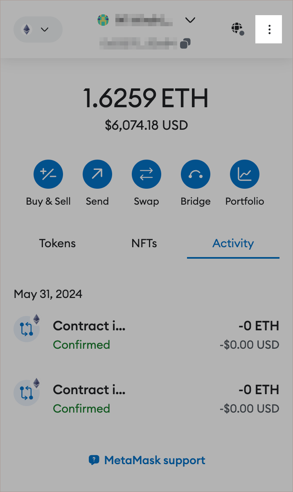

# Nahmii 1 Settlement Payloads

**Disclaimer: Interacting directly with smart contracts should only be attempted by experienced users. Mistakes can be
expensive and irreversible. If you are not confident using Ethereum, please seek help from someone who is. This guide is
provided for illustrative purposes only, Nahmii AS accepts no liability for funds lost as a result of your actions
following this document. Use at your own risk.**

Earlier this year we announced plans to decommission the first version of Nahmii’s scaling protocol, Nahmii 1.0 which
has been live since 2018. Users were given the option to transfer funds to Nahmii 2.0 using our trusted bridge service,
which closed at the end of May. Any remaining funds on Nahmii 1.0 will require a manual withdrawal, details of which can
be found in this guide.

Before we dive into the details, we’d like to highlight some important points:

* All funds on Nahmii 1.0 are safe and can be withdrawn using the published payload data **at any point in the future**
* Manual withdrawals require up to three transactions on mainnet Ethereum (not on Nahmii 1.0)
* These transactions will use around 2.5 million gas in total, which can be expensive if gas prices are high
* This guide refers to MetaMask (a popular wallet management browser extension) as the preferred method for making
  transactions. Other methods are possible, but not covered here
* Nahmii AS will not be providing further support for users who wish to withdraw from Nahmii 1.0 at this stage beyond
  the information in this guide
* Please read the disclaimer at the top of this page!

# Three Steps

Nahmii 1.0 withdrawals normally require three transactions, but some wallets have funds that are part-way through this
process. We’ll start with the most common scenario, where a wallet has no pending withdrawals. If your wallet has a
pending transaction, this is covered under ‘Wallets with Pending Transactions’ later in the guide. Please note that all
transactions happen on-chain, i.e. on Ethereum mainnet.

The first step in the withdrawal process is to **start a settlement challenge**. This starts a five-day timer, during
which anyone can challenge your settlement request if they believe it to be fraudulent. Assuming that your settlement
request reaches the five-day cutoff without being challenged, the second step is to ‘**settle**’ (i.e finalise your
settlement). At this point, funds are ready to be withdrawn from Nahmii 1.0’s treasury. The third and final step is to**
withdraw**, at which point tokens will be sent to your wallet.

Typical gas usage and the recommended gas limit for each transaction is set out below:

1. Start settlement challenge – 650,000 typical gas usage, 1,000,000 recommended gas limit
2. Settle – 1,500,000 typical gas usage, 1,750,000 recommended gas limit
3. Withdraw – 415,000 typical gas usage, 500,000 recommended gas limit

Please note: these amounts can vary, but typical values are based on a reasonably large sample size. We cannot provide
guidance relating to gas prices for these transactions; it is your responsibility to ensure that a sufficiently high gas
price is used for each transaction. Note that MetaMask is not always a reliable source of accurate gas prices for
quicker transactions, which can sometimes be extremely high.

# Payload Data & MetaMask

Nahmii 1.0 withdrawals begin with the user signing a transaction to start a settlement challenge, which is countersigned
by the operator of the network (i.e. Nahmii AS). Now that Nahmii 1.0 is offline, there is no operator to countersign
settlement requests. As such, we have published the transaction ‘payloads’ for every wallet on Nahmii 1.0 as if they
have requested a full withdrawal. These payloads are sufficient to process a withdrawal for all wallets, regardless of
whether they have started a full or partial withdrawal previously.

Begin by navigating to the [‘NII’](NII) folder. Inside this folder you will find a folder for every
wallet on Nahmii 1.0 with a non-zero balance. Find your wallet address.

For the next step, we will need to use MetaMask to add hex data to a transaction on Ethereum. This option is not enabled
by default. You will need to open and unlock MetaMask, then navigate to your wallet by clicking on the icon in the top
right corner:

  <kbd>
    
  </kbd>

Next, select the options: ‘Settings’, then ‘Advanced’ and enable ‘Show hex data’:

  <kbd>
    
  </kbd>

You are now ready to start or complete the withdrawal process.

# Sending Transactions

After finding the folder with the same name as your wallet address, you will see something like this:

  <kbd>
    
  </kbd>

The list of steps shown here depends on whether your wallet has an in-progress settlement or not. Regardless, you should
follow the steps as described.

Each step in the process will require you to send a 0 ETH transaction to the contract address listed under ‘Contract’.
Using the example from above, begin by opening and unlocking MetaMask (which should be connected to the wallet you wish
to use).

Click ‘Send’ to open the transaction page:

  <kbd>
    
  </kbd>

Next, add the contract address from the payload data page (e.g. 0x34fe0c8100dc8ec65e50ff195faa93297ebf4f19 for the
example shown above).

**Note: this address will not be the same for all wallets, as it depends on whether there is a withdrawal in progress.
DO NOT SIMPLY COPY THE ADDRESS ABOVE WITHOUT CHECKING!**

You can now copy the ‘Method Payload’ data into the ‘Hex Data’ field here:

  <kbd>
    
  </kbd>

Recall the suggested gas limits from earlier:

1. Start settlement challenge – 650,000 typical gas usage, 1,000,000 recommended gas limit
2. Settle – 1,500,000 typical gas usage, 1,750,000 recommended gas limit
3. Withdraw – 415,000 typical gas usage, 500,000 recommended gas limit

You should therefore use a gas limit of 1,000,00 gas or higher for the first transaction.

Remember: the transaction amount should be left as 0 ETH.

# Steps 2 & 3

Assuming once more that your wallet did not have any pending settlement requests, the first transaction will start a
five-day timer during which you cannot continue the process.

Wait for five days. Once this period has elapsed, you can move on to the final two transactions. Note: the five-day
waiting period applies between the first and second transactions only – once this stage is complete, the final two
transactions can be processed sequentially (i.e. no waiting is required).

For steps 2 and 3, simply repeat the process set out above, using the correct contract address for each one (as stated
in the GitHub folder).

Remember: each step in the process has a different suggested gas limit. The values for steps 2 and 3 are:

1. Settle – 1,500,000 typical gas usage, 1,750,000 recommended gas limit
2. Withdraw – 415,000 typical gas usage, 500,000 recommended gas limit

When the third transaction is processed, funds will be transferred from the Nahmii 1.0 deposit contract (where all
user’s deposits are kept) back to your wallet on Ethereum mainnet. The process is then complete.

# Wallets with Pending Withdrawals

A small number of wallets have a pending withdrawal (i.e. they have completed steps 1 or 2 but not 3). The instructions
for these wallets are similar to those for wallets without a pending transaction, with the important caveat that the
pending withdrawal will first need to be cancelled.

As before, the instructions in your dedicated payload folder will take you through each step in turn. Follow the process
as outlined above, taking care to specify the correct contract address for each step and gas limit.
